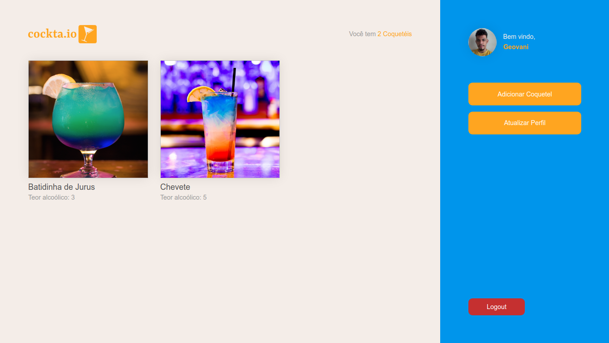

# Cockta.io :tropical_drink:
Link do back-end da aplicação: [Cockta.io API](https://github.com/GeovaniJose/ruptiva-challenge-api)

> :underage: Àlcool para menores é proibido

<div align="center">
  <a href="https://github.com/GeovaniJose/ruptiva-challenge-api">
    
  </a>
</div>

## Instalação :sparkles:
> Você precisa ter instalado em sua máquina o [Git](https://git-scm.com) e o [Yarn](https://yarnpkg.com/)
1. Clone este repositório
```bash
$ git clone https://github.com/GeovaniJose/ruptiva-challenge-web.git
```

2. Entre na pasta do repositório
```bash
$ cd ruptiva-challenge-web
```

3. Rode o comando para instalar as dependências
```bash
$ yarn
```

## Como rodar :white_check_mark:
> Passo a passo para rodar a aplicação
1. Inicie o back-end da aplicação

2. Rode o comando para iniciar a aplicação
```bash
$ yarn start
```

## Tecnologias :wrench:
> Tecnologias usadas no desenvolvimento do projeto:
- React
- TypeScript
- Yarn
- Styled-components
- Unform
- Yup
- Axios
- Polished

## License :page_facing_up:
[MIT License](LICENSE)
